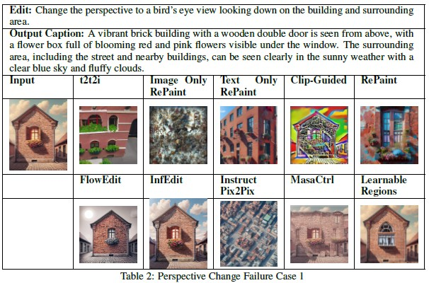
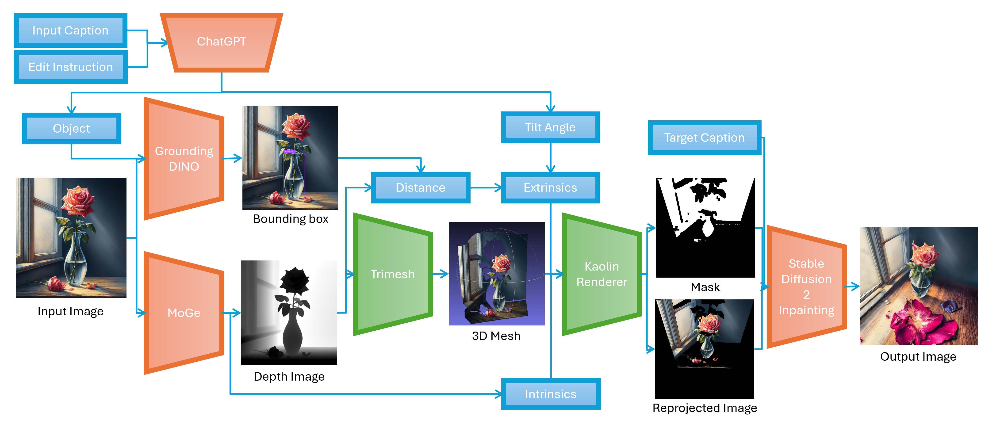
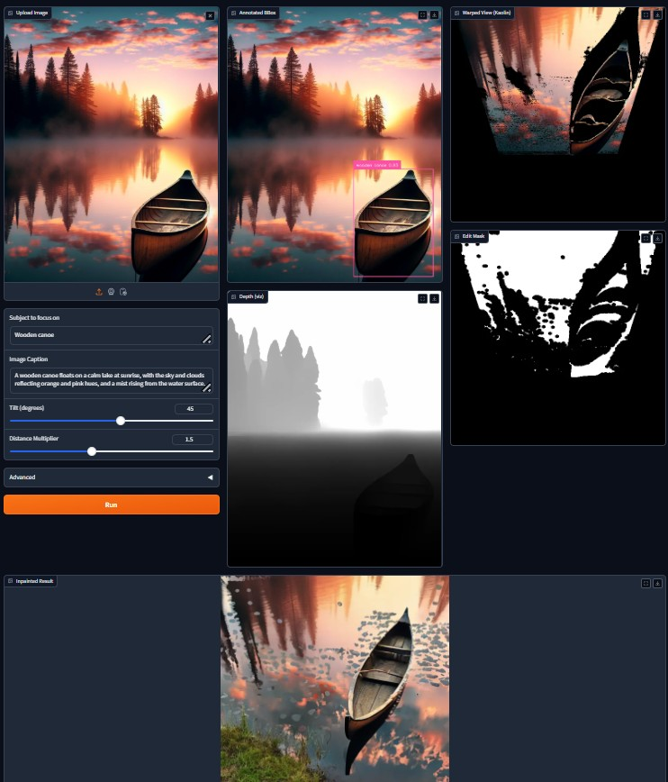
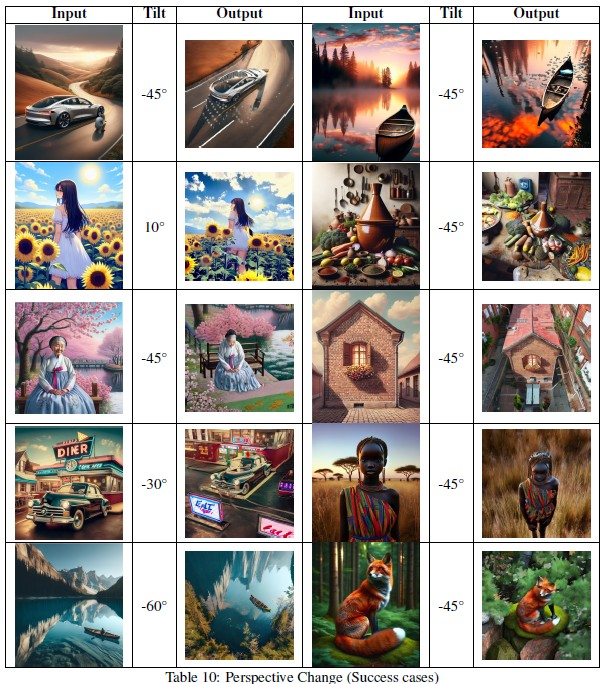
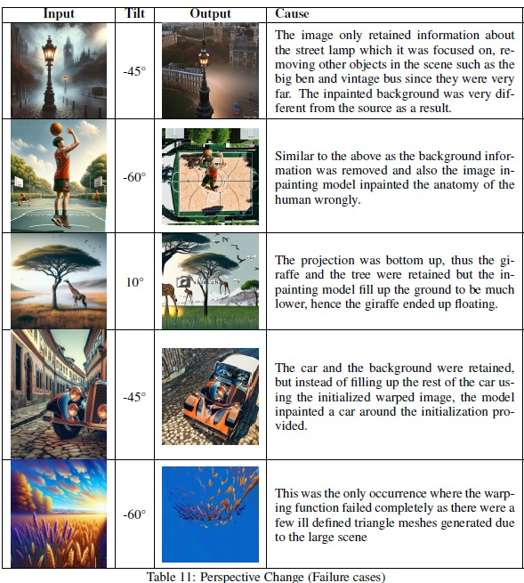

# Perspective change pipeline

This pipeline was developed as part of my Multimodal Machine Learning Project in 11-777 where we explored text based image editing. 

We split image editing into 12 different types of tasks which included perspective changes, instance specific color changes, overall image color changes, texture changes, background changes, size changes, movement changes, etc.

One of the limitations we noticed in existing image editing models is that they were incapable of performing perspective changes well as shown in the figure below.



Thus we developed a pipeline to performing perspective changes by lifting the image from 2D to 3D using MoGe, a monocular depth estimator, creating a mesh and re-rendering the scene. Inpainting is then done to fill in the unknown areas.



In this repo we include the Gradio App for testing, We use a RTX 3090 with 24GB VRAM to run the demo. 




## installation

We include a conda environment.yml file for installation which can be installed by 
```
conda env create -f environment.yml
```

We then also need to install GroundingDINO and MoGe

To install GroundingDino
```
git clone https://github.com/IDEA-Research/GroundingDINO.git
cd GroundingDINO/
pip install -e .
mkdir model_cache
cd model_cache
wget -q https://github.com/IDEA-Research/GroundingDINO/releases/download/v0.1.0-alpha/groundingdino_swint_ogc.pth
cd ..
```

To install MoGe
```
git clone https://github.com/microsoft/MoGe.git
cd MoGe
pip install -r requirements.txt   # install the requirements
```

## Qualitative Results

We demonstrate that our pipeline works for many different types of images, with significant viewpoint change of 45 degrees:


However, we also note that it is with limitations as it is highly dependent on multiple factors i.e. the depth estimator, the size of the objects in the scene, the ability of the inpainting model to inpaint well given the contexts provided.

We also note that larger viewpoint changes will perform poorly as most of the information provided is from the mesh generated by the image and less information can be inferred from larger perspective changes.

